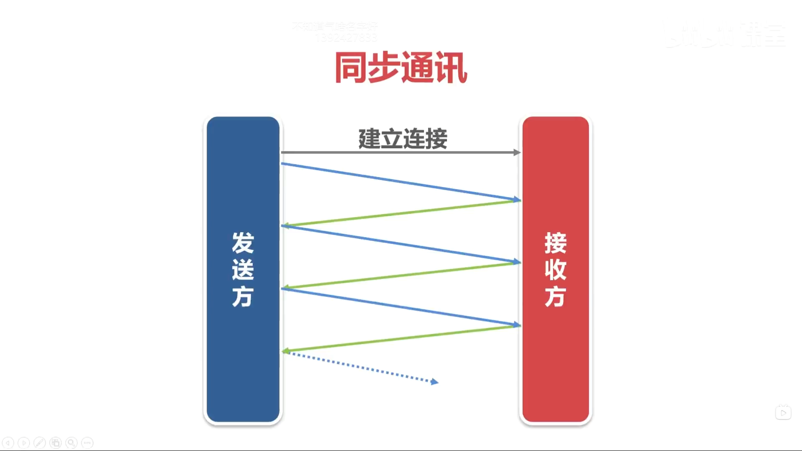

# Shougang-Jingtang-Data-Center-Backend-Development
老师致力于流程智能制造以及智能钢厂，是行业大牛。该项目前期在实验室完成，后期到公司调研、分析需求合理性，最终在厂里进行部署。

我放了一些开发过程中学习的知识点，在项目笔记中。


# ==二、服务程序的监控和调度==

# 1、调度模块/project/tools/cpp/procctl.cpp

## 思路：

- ==直接看72行源码！==


## :red_circle:用到的知识

```cpp
int execl(const char *path, const char *arg, ...);
int execv(const char *path, char *const argv[]);
注意：
1）如果执行程序失败则直接返回-1，失败原因存于errno中。
2）新进程的进程编号与原进程相同，但是，新进程取代了原进程的代码段、数据段和堆栈。
3）如果执行成功则函数不会返回，当在主程序中成功调用exec后，被调用的程序将取代调用者程序，也就是说，exec函数之后的代码都不会被执行。
4）在实际开发中，最常用的是execl()和execv()，其它的极少使用。

//使用
#include <iostream>
#include <string.h>
#include <unistd.h>
using namespace std;

int main(int argc,char *argv[])
{
  int ret=execl("/bin/ls","/bin/ls","-lt","/tmp",0);  // 最后一个参数0不能省略。
  cout << "ret=" << ret << endl;
  perror("execl");

  /*
  char *args[10];
  args[0]="/bin/ls";
  args[1]="-lt";
  args[2]="/tmp";
  args[3]=0;     // 这行代码不能省略。

  int ret=execv("/bin/ls",args);
  cout << "ret=" << ret << endl;
  perror("execv");
  */
}
```


# 2、进程心跳/project/tools/cpp/heartbeat.cpp

## 思路

==//设置心跳进程结构体{进程pid，进程名，超时时间，存活时间}==

//处理程序的退出信号。

==//创建/获取共享内存。==

==//将共享内存连接到当前进程的地址空间。==

==//把当前进程的信息填充到结构体中。==

==//在共享内存中寻找一个空的位置，把当前进程的结构体保存到共享内存中。==

==//更新进程的心跳信息。==

==//从共享内存中删除当前进程的心跳信息。==

==//把共享内存从当前进程分离。==


## 知识点

#### **:red_circle:shmget函数**

该函数用于创建/获取共享内存。

- int shmget(key_t key, size_t size, int shmflg);

- key       共享内存的键值，是一个整数（typedef unsigned int key_t），一般采用十六进制，例如0x5005，不同共享内存的key不能相同。

- size      共享内存的大小，以字节为单位。

- shmflg  共享内存的访问权限，与文件的权限一样，例如0666|IPC_CREAT，0666表示全部用户对它可读写，IPC_CREAT表示如果共享内存不存在，就创建它。

- 返回值：成功返回共享内存的id（一个非负的整数），失败返回-1（系统内存不足、没有权限）

- 用**ipcs -m**可以查看系统的共享内存，包括：键值（key），共享内存id（shmid），拥有者（owner），权限（perms），大小（bytes）。

- 用**ipcrm -m** 共享内存id可以手工删除共享内存，如下：


#### :red_circle:shmat函数

该函数用于把共享内存连接到当前进程的地址空间。

- void *shmat(int shmid, const void *shmaddr, int shmflg);

- shmid          由shmget()函数返回的共享内存标识。

- shmaddr    指定共享内存连接到当前进程中的地址位置，通常填0，表示让系统来选择共享内存的地址。

- shmflg         标志位，通常填0。

- 调用成功时返回共享内存起始地址，失败返回(void*)-1。


#### :red_circle:shmdt函数

该函数用于将共享内存从当前进程中分离，相当于shmat()函数的反操作。

- int shmdt(const void *shmaddr);

- shmaddr     shmat()函数返回的地址。

- 调用成功时返回0，失败时返回-1。


#### :red_circle:shmctl函数

该函数用于操作共享内存，最常用的操作是删除共享内存。

- int shmctl(int shmid, int command, struct shmid_ds *buf);

- shmid          shmget()函数返回的共享内存id。

- command   操作共享内存的指令，如果要删除共享内存，填IPC_RMID。

- buf               操作共享内存的数据结构的地址，如果要删除共享内存，填0。

- 调用成功时返回0，失败时返回-1。


## 一些细节

:red_circle:第一个问题：当程序异常退出如kill -9 或 段错误，那么EXIT没机会执行，共享内存会残留(这(异常退出)是不可避免地)。因此在程序执行开始在共享内存寻找空位置的时候，共享内存中残留了进程的信息并且进程编号与当前进程相同，就重用这个旧位置而不再寻找共位置了！

:red_circle:第二个问题：多个进程同时操作共享内存，会造成安全性的问题。需要对共享内存加锁（内存框架中的信号量csemp类）。程序对共享内存的操作由三个：1.在共享内存中寻找一个新的位置，把当前进程结构体写入共享内存	2.更新自己在共享内存的结构体的心跳时间。 3.从共享内存中删除自己。 通过分析可知只需要在1操作加锁即可，因为23操作只会操作自己那部分结构体，不会造成冲突！这里一定要搞明白。

:red_circle:==3.将heatbeat封装成进程心跳的类，便于在后续服务程序中使用。==


# 3、守护模块/project/tools/cpp/checkproc.cpp

## 思路

​	//程序的帮助。

​    //忽略全部的信号和关闭I/O，设置信号处理函数。

​	//打开日志文件

​    ==//创建/获取共享内存，键值为SHMKEYP，大小为MAXNUMP个st_procinfo结构体的大小。==

​    ==//将共享内存连接到当前进程的地址空间。==

​    ==//遍历共享内存中全部的记录，如果进程已超时，终止他。==

​    ==//把共享内存从当前进程中分离。==

## 知识点

:red_circle:判断进程是否存在的方法：向进程发送信号0，返回-1则说明进程已经不存在了。

```cpp
int iret=kill(m_shm[ii].pid,0);
if(iret==-1)
{
    logfile.write("进程pid=%d(%s)已经不存在。\n",shm[ii].pid,shm[ii].pname);
    memset(&shm[ii],0,sizeof(struct st_procinfo));   // 从共享内存中删除该记录。
    continue;
}
```

:red_circle:demo02.cpp细节，cpactive pactive要设置为全局变量，否则exit(0);的时候不会调用pactive的析构。

​		**exit()表示终止进程，不会调用局部对象的**[**析构函数**](https://so.csdn.net/so/search?q=析构函数&spm=1001.2101.3001.7020)**，只调用全局对象的析构函数**。


## 一些细节

:red_circle:demo02.cpp细节，cpactive pactive要设置为全局变量，否则exit(0);的时候不会调用pactive的析构。

​		**exit()表示终止进程，不会调用局部对象的**[**析构函数**](https://so.csdn.net/so/search?q=析构函数&spm=1001.2101.3001.7020)**，只调用全局对象的析构函数**。

:red_circle:如果进程已经不存在了，共享内存中是残留的心跳信息。向进程发送信号0，判断它是否还存在，如果不存在，从共享内存中删除该纪录，continue；

```cpp
int iret=kill(m_shm[ii].pid,0);
if(iret==-1)
{
    logfile.write("进程pid=%d(%s)已经不存在。\n",shm[ii].pid,shm[ii].pname);
    memset(&shm[ii],0,sizeof(struct st_procinfo));   // 从共享内存中删除该记录。
    continue;
}
```

:red_circle:如果一个超时的进程无法响应15信号（已经死掉或者其他原因）不能正常退出该怎么办？

​	先发送15信号尝试正常终止超时的进程；再发送0信号(给一些时间让进程退出)，判断它是否存在；不存在说明正常终止了，存在说明未正常终止进行强制终止-9并清理共享内存中的进程心跳记录。


# 4、服务程序的运行策略

## 思路

#### :red_circle:==全部的服务程序启用心跳机制，调度模块和守护模块除外。--所有程序要使用cpactive类。==

#### :red_circle:==全部的服务程序用调度模块(procctl)启动。--进程退出了按一定时间间隔自动重启程序。==

#### :red_circle:==启动守护模块(checkproc)，如果服务程序超时，终止它，调度模块procctl将重新启动服务程序。--这个程序在全过程中监控。==


## 知识点

:red_circle:如果想在操作系统启动时自动启动所有服务程序可以在/etc/rc.local中配置。

```rc.local
# 启动守护模块,建议在/etc/rc.local中配置，以超级用户的身份启动。
/project/tools/bin/procctl 10 /project/tools/bin/checkproc /tmp/log/checkproc.log

# 启动首钢京唐数据汇聚平台的服务程序
su - xianwu -c "/project/idc/cpp/start.sh"
```

​	增加可执行权限 chmod +x /etc/rc.d/rc.local   或者  chmod 777 /etc/rc.d/rc.local

## 代码

在start.sh中配置脚本

## 一些细节

守护进程启动在==超级用户权限==下自动启动。原因是1.守护进程太重要了，不小心删掉麻烦就大了。2.一台机器只要启动一次守护进程，并且没有重启的必要。


# 5、两个小工具

## 5.1 清理文件/project/tools/cpp/deletefiles.cpp

### 思路

生成的文件csv json xml源源不断，那么写个程序我们把0.02天之前的文件给自动删除。

​	//程序的帮助。

​    //忽略全部的信号和关闭I/O，设置信号处理函数。

​    ==//获取被定义为历史数据文件的时间点。==

​    ==//打开目录。==

​    ==//遍历目录中的文件，如果是历史数据文件，删除它。==

### 一些细节

删除历史文件很快的，不需要增加更新进程心跳的代码。

## 5.2 压缩文件/project/tools/cpp/gzipfiles.cpp

### 思路

==用于压缩*.log日志文件，日志太大系统会自动切换.log.20240506...因此对日志文件目录进行压缩。==

​	//程序的帮助。

​    //忽略全部的信号和关闭I/O，设置信号处理函数。

​    ==//获取被定义为历史数据文件的时间点。==

​    ==//打开目录。==

​    ==//遍历目录中的文件，如果是历史数据文件，压缩它。==

### 知识点

```cpp
//压缩文件，使用操作系统的gzip命令。
string strcmd="/usr/bin/gzip -f " + dir.m_ffilename + " 1>/dev/null 2>/dev/null";
if (system(strcmd.c_str())==0)		//使用system执行linux命令。
    cout << "gzip " << dir.m_ffilename << "  ok.\n";
else
    cout << "gzip " << dir.m_ffilename << " failed.\n"; 
```

### 一些细节

:red_circle://如果压缩的文件比较大，有几个G，需要的时间可能==比较长==，所以，增加更新进程心跳的代码。

----

# FTP和TCP传输模块三种传输方式

1. **下载文件后，删除ftp服务器上的文件。**
2. **下载文件后，把ftp服务器上的文件移动到备份目录。**
3. **增量下载文件，每次只下载新增的和修改过的文件。**

# ==三、基于FTP协议的文件传输模块开发==

:red_circle:==思路==：寻找ftp客户端的开源库(ftplib)，封装成简单易用的类cftp

## 1、配置FTP服务等工作

### 1.1 配置FTP服务，参考文档。

### 1.2 理解FTP的主动模式和被动模式原理。

#### 1.2.1 主动模式

客户端给服务端的21端口发命令说：我要输传文件，我已经打开了自己的20端口，你向我的20端口发起TCP连接，我们来传输文件。服务端收到客户端的请求后，就会主动向客户端的20端口发起连接，连接成功后开始传输文件。

     

在主动模式下，ftp请求是由客户端TCP连接的；传输数据的时候，TCP连接却是由服务端发起的。

#### 1.2.2 被动模式

客户端给服务器端的21端口发命令说：我要传输文件。服务器端收到客户端的请求后，打开一个空闲的高端口，然后告诉客户端，我已经打开了某某端口，你向我这个端口发起TCP连接，然后我们用这个端口来传输文件。

   

在被动模式下，不管是执行ftp命令，还是传输数据，都是由客户端向服务端发起TCP连接的。

### 1.3 手工执行FTP的一些命令(客户端的使用)

#### 1.3.1 登录服务器：ftp 192.168.192.136:21

#### 1.3.2 切换工作目录

- ​	查看服务器工作目录：**pwd**

- ​	切换服务器工作目录：**cd 目录名**

- ​	切换本地工作目录：**lcd 目录名**


#### 1.3.3 查看服务器上的目录和文件

- 列出目录或文件名的详细信息
  - **ls**  目录或文件名
  - **dir** 目录或文件名

- 仅列出目录和文件名


​	**:red_circle:nlist 目录或文件名 [本地文件名]**

​	1）列出/project/public目录下的匹配*.h的文件名信息。

​		==nlist /project/public/*.h==

​	2）列出/freecplus目录下的匹配*.h的文件名信息，结果输出到本地的/tmp/public.list文件中。(一般程序中用)

​		==nlist /project/public/*.h /tmp/public.list==

#### 1.3.4 下载/上传文件 

##### 1、文件传输的模式

ftp传输文件的模式分二进制和ASCII码两种模式，二进制模式可以传输任何文件，包括压缩包、可执行程序、图片、视频、音频等，而ASCII模式只能传输.txt、.htm等ascii码文件（文本文件）。在实际开发中，不管什么文件，都用二进制方式传输。

1）查看当前的传输模式。

​	type

2）设定传输模式为二进制。

​	bin

3）设定传输模式为ASCII。

​	ascii

##### :red_circle:2、下载文件

**1**）**下载单个文件**

**get** 服务端文件名 [本地文件名]

**2**）**下载多个文件**

**mget** 服务端文件1 服务端文件2 服务端文件3 …… 服务端文件n

- 下载文件时，会一一提示，如果想关闭提示信息，先输入prompt命令。


​		prompt

##### :red_circle:3、上传文件 

**1**）**上传单个文件**

put本地文件名 [服务端文件名]

**2**）**上传多个文件**

mput 本地文件1 本地文件2 本地文件3 …… 本地文件n

- 上传文件时，会一一提示，如果想关闭都显示信息，先输入prompt命令。


​		prompt

#### 1.3.5 其它ftp命令 

1）重命名ftp服务端的文件

​			**rename 旧文件名 新文件名**

**2**）**删除ftp服务端上单个文件**

​			**delete 文件名**

3）删除ftp服务端的多个文件。

​			**mdelete 文件名1 文件名2 文件名3 …… 文件名n**

**4**）**在ftp服务端上创建目录。**

​			**mkdir pathname**

5）删除ftp服务端上的目录。

​			**rmdir pathname**

6）切换传输模式。

​			passive

7）显示帮助信息。

​			help [命令名]

显示ftp命令的帮助信息，如果不输入命令名，则显示全ftp命令的帮助信息。

8）退出ftp。

​			bye


### 1.4 将ftplib.h，ftplib.c封装为_ftp.h==和 ==_ftp.cpp框架。

==思路：从github上找到开源库ftplib，封装成自己的_ftp类==

封装的一些细节

​	==get函数首先在本地创建了目录(目录不存在会自动创建)，但是在put函数中没有自动创建目录。==原因是在服务端创建目录是很麻烦的，每个ftp命令在底层都要进行一次tcp通信，向服务端发送一个报文再接受回应，需要时间。如果每次上传都要自动创建有额外的tcp通信，消耗的时间比较长性能比较低。如果需要在服务端创建目录，需要在代码中创建，而不是在put函数中封装。

:red_circle:get封装思路：

bool cftpclient::get(const string &remotefilename,const string &localfilename,const bool bcheckmtime)

​	// 创建本地文件目录。

​	// 生成本地文件的临时文件名。

​	// 获取远程服务器的文件的时间。

​	// 取文件。

​	// 判断文件下载前和下载后的时间，如果时间不同，表示在文件传输的过程中已发生了变化，返回失败。

​	// 重置文件时间。

​	// 改为正式的文件。

​	// 获取文件的大小。

:red_circle:put封装思路:

bool cftpclient::put(const string &localfilename,const string &remotefilename,const bool bchecksize)

​	// 生成服务器文件的临时文件名。

​	// 获取上传文件之前的时间。

​	// 发送文件。

​	// 获取上传文件之后的时间。

​	// 如果文件上传前后的时间不一致，说明本地有修改文件，放弃本次上传。

​	// 重命名文件。

​	// 判断已上传的文件的大小与本地文件是否相同，确保上传成功。一般来说，不会出现文件大小不一致的情况，如果有，应该是服务器方的原因，不太好处理。

## 2、ftp文件下载模块

### 完成阶段（一）

#### 思路

​	//程序的帮助。

​    //忽略全部的信号和关闭I/O，设置信号处理函数。

​	//打开日志文件

​    ==//解析xml，得到程序运行的参数。==

​    ==//登录ftp服务器==

​    ==//进入ftp服务器存放文件的目录==

​    ==//调用ftpclient.nlist()方法列出服务器目录中的文件名，保存在本地文件中。==

​    ==//把ftpclient.nlist()方法获取到的list文件加载到vfilelist中。==

​    ==//遍历vfilelist容器。==

​    ==// for(auto &aa:vfilelist)==

​    ==// {==

​    ==//     //调用ftpclient.get()方法下载文件。==

​    ==// }==

#### 知识点

复习matchstr函数和getxmlbuffer函数。

本次代码备份在：/project/tools/cpp/bak/ftpgetfiles.cpp1

### 完成阶段（二）

**每次都下载全部的文件是不合理的，有三种解决方案：**

1. **下载文件后，删除ftp服务器上的文件。**
2. **下载文件后，把ftp服务器上的文件移动到备份目录。**
3. **增量下载文件，每次只下载新增的和修改过的文件。**

#### 思路

先完成1、2两种方案，增量下载比较麻烦，见下载模块(三)。

//参数结构体st_arg中添加两个成员

```cpp
//(二)
    int ptype;                  //下载后服务端文件的处理方式：1-什么也不做(增量下载)；2-删除；3-备份。
    char remotepathbak[256];    //下载后服务端文件的备份目录。
```

==//for循环下载文件后判断ptype进行相应的操作==

备份在：/project/tools/cpp/bak/ftpgetfiles.cpp2

### 完成阶段（三）

==实现增量下载文件，每次只下载新增的和修改过的文件。==

#### 思路

==//创建四个容器==

​	1-mfromok容器：过去已下载成功的文件(okfilename的xml文件)；

​	2-vfromnlist：ftp.nlist()返回的结果；

​	3-vtook：非新增、未修改的文件，表示已经下载不需要再重下的；

​	4-vdwonload：新增、修改过的文件，表示需要下载；

//创建四个容器1234，容器234只用便利，使用list链表即可，容器1为了查找使用二叉树map

主函数中

==//获取得到vfromnlist==

==//获取得到mfromok==

==//比较得到vtook和vdownload==

==//把vtook容器(已下载的)数据覆盖okfilename文件==

==for(auto &aa:vdownload)	//遍历vdownload==

=={==

​	==//下载文件==

​	==//下载的文件追加到okfilename中==

==}==


第n次运行：==mfromok = 上一次容器3 vtook + 上一次容器4 vdownload==

#### 一些细节

//心跳超时的时间由业务和网络环境决定，不能写死，让用户手动填入即可。所以在main函数参数xml文件中需要timeout和pname参数。

第n次运行：==mfromok = 上一次容器3 vtook + 上一次容器4 vdownload==

## 3、ftp文件上传模块

#### 思路

​		根据ftp文件下载模块的代码进行修改得到。

#### 知识点

int remove(const char *__filename)是删除。

bool idc::renamefile(const std::string &srcfilename, const std::string &dstfilename)

​	重命名文件，类似Linux系统的mv命令

#### 一些细节

1.调用ftp.put()方法上传服务端文件，第三个参数填true(检查大小)，确保上传成功，对方不可抵赖。

2.上传文件模块不用bool checkmtime;因为核对时间是本地操作，并且ftp.put()函数内部默认核对时间（因为在本地拿到文件时间几乎没有时间代价）。


# ==四、基于TCP协议的文件传输模块==

:large_blue_circle:**基于FTP的文件传输系统特点：**

- **ftp协议简单、通用**
- **ftp的效率比较低（tcp通讯采用一问一答的方式，交互次数太多）。**
- **适用于系统之间传输文件。**

:large_blue_circle:**FTP应用场景：**

- **我把文件放在服务器上，并且开通了ftp服务，谁需要文件就过来拿。**
- **我开通了ftp服务，你把文件放在某个目录中就行了，我自己会从目录中取。**

:red_circle:基于TCP协议的文件传输系统

- **自定义通讯方式。**
- **效率极高。**比ftp快十倍。
- **适用于系统内部快速高效的传输文件。**

## 1、tcp短链接和长连接

#### 1.1 短链接


特点：==建立连接-->数据通信-->断开连接==是连续的没有时间间隔。

优点：使用简单，代码写起来也简单。

缺点：效率低，建立连接三次握手，断开连接四次挥手。


#### 1.2 长连接


特点：

- 建立连接后不一定马上通信，可以有时间间隔。
- 请求报文也可由服务端主动发起，建立连接后客户端和服务端就没区别了。

优点：效率高。

缺点：需要管理，代码写起来麻烦一些。

​			为什么需要管理？

​					1. 理想状态下，一个TCP连接可以被长期保持。

​					2. 实际情况下，一个看似正常的TCP连接，可能已经断开，建立的连接有多个中间节点。


## 2、文件上传模块

### 文件上传模块（一）

先搭好fileserver.cpp和tcpputfiles.cpp框架，先实现心跳报文即可。

#### 1 fileserver.cpp1思路

​	//程序的帮助。

​    //忽略全部的信号和关闭I/O，设置信号处理函数FathEXIT、ChldEXIT。

​	//打开日志文件

​	while(true)

​	{

​		//tcpserver.accept()等客户端练上来

​		if(fork()>0)	continue;		//交给子进程服务客户端。主进程继续回到开始继续等待连接。

​		//接收心跳包文并回复 ok

​	}

#### 知识点

​	==多进程编程==

​	==主进程子进程的信号处理函数FathEXIT、ChldEXIT==

#### 一些细节

​		:red_circle:while(true)中创建进程后，将主进程的用于通信的socket关闭，将子进程的用于监听的socket关闭。

#### 踩的坑

后面开发完发现的坑：fileserver运行一段时间系统会很卡，top命令发现zombie僵尸进程不断增加，原因是：fileserver主进程没有忽略子进程退出的信号，应该加上signal(SIGCHILD,SIG_IGN);

#### 2 tcpputfiles.cpp1思路

​	//程序的帮助。

​    //忽略全部的信号和关闭I/O，设置信号处理函数。

​	//打开日志文件

​	//向服务端发起连接请求

​	while(true)

​	{

​		//睡眠十秒

​		//发送心跳报文

​		//等待回复

​	}

#### 知识点

​	多进程编程

### 文件上传模块（二）

#### 1 fileserver.cpp2思路

​	//程序的帮助。

​    //忽略全部的信号和关闭I/O，设置信号处理函数FathEXIT、ChldEXIT。

​	//打开日志文件

​	while(true)

​	{

​		//tcpserver.accept()等客户端练上来

​		if(fork()>0)	continue;		//交给子进程服务客户端。主进程继续回到开始继续等待连接。

​		==// 处理登录客户端的登录报文。==**服务端需要知道客户端的参数信息，接收他的参数。**

​		//接收心跳包文并回复 o k

​	}

#### 一些细节

starg参数中有timetvl(扫描本地文件时间间隔)，程序不会退出，会一直执行。为什么ftp模块不需要这个参数？因为使用ftp的化要求没这么高。


#### 2 tcpputfiles.cpp2思路

​	//程序的帮助。

​    //忽略全部的信号和关闭I/O，设置信号处理函数。

​	//打开日志文件

​	==// 解析xml，得到程序运行的参数。==将xml参数解析到结构体。

​	//向服务端发起连接请求

​	==// 向服务端发送登录报文，把客户端程序的参数传递给服务端。==需要告诉服务端参数信息。

​	while(true)

​	{

​		//睡眠十秒

​		//发送心跳报文

​		//等待回复

​	}

### 文件上传模块（三）

前面两个模块，已经实现了客户端登录并且通过TCP报文把客户端参数传递给了服务端，本次将实现传输文件。

#### 1 fileserver.cpp3思路

// 上传文件的主函数void recvfilesmain()中添加if(处理上传文件请求)

if(处理上传文件的请求报文。)

{

​		// 解析上传文件请求报文的xml。

​		//接收文件内容“暂时不实现”

​		//假设成功的接受了文件的内容，拼接确认报文的内容。

​		//把确认报文返回给对端。

}

#### 一些细节

​		数据以及信息传输的中间过程均用XML格式。

#### 2 tcpputfiles.cpp3思路

文件上传bool _tcpputfiles()实现思路：


// 打开starg.clientpath目录。

// 遍历目录中的每个文件while(dir.readdir())

{

​		// 把文件名、修改时间、文件大小组成报文，发送给对端。

​		// 发送文件内容，暂不实现。

​		// 接收服务端的确认报文。

​		// 处理服务端的确认报文（删除本地文件或把本地文件移动到备份目录）。决定采取123哪种方式。

}

### 文件上传模块（四）

#### 1 fileserver.cpp4思路

​		主要编写接收文件内容的函数bool recvfile(const string &filename,const string &mtime,int filesize)。

while(已读取字节数 ! = 文件大小)

{

​		// 计算本次应该接收的字节数。

​		// 接收文件内容。

​		// 把接收到的内容写入文件。

​		// 计算已接收文件的总字节数，如果文件接收完，跳出循环。

}

//设置下载的文件时间， 文件时间用当前时间没有意义，应该与对端的文件时间保持一致。

#### 2 tcpputfiles.cpp4思路

​		主要编写 把文件的内容发送给对端的函数bool sendfile(const string &filename,const int filesize);

while(已读取字节数 ! = 文件大小)

{

​		// 计算本次应该读取的字节数，如果剩余的数据超过4096字节，就读4096字节。

​		// 从文件中读取数据。

​		// 把读取到的数据发送给对端。

​		// 计算文件已读取的字节总数，如果文件已读完，跳出循环。

}

#### 以上完成的代码存在的问题：

​		之前自己vi几个文件测试没问题。但是当文件量多起来，如1000、10000及以上的时候，出现问题。

### 文件上传模块（五）

这次代码主要为了实现I/O复用技术，传输效率更高。在3节（下一节介绍异步通信多进程和多路复用，发现多进程效率更高但是编程复杂，多路复用IO效率也不错，编程容易一些。）

#### 1.fileserver.cpp5思路

##### 知识点

​	多路复用

##### 一些细节

​	// 接收客户端的报文。if (tcpserver.read(strrecvbuffer,==starg.timetvl+10==)==false)

#### 2.tcpputfiles.cpp思路最终版本

##### 知识点

I/O多路复用：边发送边监听确认报文。

##### 一些细节

​    //如果刚才执行文件上传任务的时候上传了文件，那么，在上传的过程中，可能有新的文件陆续生成。为保证文件被尽快上传，进程不休眠。（只有在刚才执行文件上传任务的时候没有上传文件的情况下才休眠）设置bcontinue标志位。

# 3、同步通讯和异步通讯

用于测试的服务端代码demo07.cpp

```cpp
//demo07.cpp 服务端代码：用于测试同步通信和异步通信的性能。
//demo08.cpp 同步通信       100个报文用时：7.5s
//demo09.cpp 异步通信       1000000个报文用时：6s
//demo10.cpp I/O多路复用    1000000个报文用时：8s
#include"_public.h"
using namespace idc;

int main(int argc,char* argv[])
{
    if(argc!=2) {cout<<"./demo07 5005\n";return -1;}
    
    ctcpserver tcpserver;

    if(tcpserver.initserver(atoi(argv[1]))==false)
    {
        printf("init failed.\n");return -1;
    }

    tcpserver.accept();

    string strread,strsend;
    for(;;)
    {
        if(tcpserver.read(strread)==false)
            {printf("server read failed\n");break;}

        strsend = "回复："+strread;

        if(tcpserver.write(strsend)==false)
            {printf("server send failed\n");break;}
         
    }

    return 0;
}
```

#### 3.1 同步通讯

以上完成的TCP通讯是同步通讯的。

#### 知识点



优点：编程简单。

缺点：效率低。

#### 代码 demo08.cpp

```cpp
//同步通讯      //100个报文消耗了7~8秒。
#include"_public.h"
using namespace idc;

ctcpclient client;

clogfile logfile;

void EXIT(int sig);


int main(int argc,char*argv[])
{
    if(argc!=3) {printf("./demo08 192.168.192.136 5005\n");return -1;}

    logfile.open("/tmp/demo08.log");

    client.connect(argv[1],atoi(argv[2]));

    string strread,strsend;
    for(int ii=0;ii<10;ii++)
    {
        sformat(strsend,"我是世界第%d帅比",ii+1);
        if(client.write(strsend)==false)
            logfile.write("client.write failed.\n");
        logfile.write("%s\n",strsend.c_str());
        
        if(client.read(strread)==false)
            logfile.write("client.read failed.\n");
        logfile.write("%s\n",strread.c_str());
    }


    return 0;
}

void EXIT(int sig)
{
    logfile.write("程序退出，sig=%d\n",sig);

    exit(0);
}
```

#### 3.2 异步通讯

实现方法：

- 多进程：建立tcp连接后，一个进程发送报文，一个进程接收报文。
- 多线程：建立tcp连接后，一个线程发送报文，一个线程接收报文。
- I/O多路复用：select、poll、epoll。

方案采用poll实现。

##### 3.2.1 多进程实现方式

###### 思路

//子进程只负责发送文件

//主进程只负责接收确认报文

###### 知识点


优点：效率高。

缺点：编程复杂。

###### 代码 demo09.cpp

```cpp
//异步通信方式  1000000条报文用时 6s
#include"_public.h"
using namespace idc;

ctcpclient client;

clogfile logfile;

void EXIT(int sig);

int main(int argc,char*argv[])
{
    if(argc!=3) {printf("./demo09 192.168.192.136 5005\n");return -1;}

    logfile.open("/tmp/demo09.log");

    client.connect(argv[1],atoi(argv[2]));

    string strread,strsend;

    if(fork()==0)
    {
        //子进程
        for(int ii=0;ii<1000000;ii++)
        {
            sformat(strsend,"我是世界第%d帅比",ii+1);
            if(client.write(strsend)==false)
                logfile.write("client.write failed.\n");
            logfile.write("%s\n",strsend.c_str());
        }

    }
    else
    {
        //父进程
        for(int ii=0;ii<1000000;ii++)
        {
            if(client.read(strread)==false)
                logfile.write("client.read failed.\n");
            logfile.write("%s\n",strread.c_str());
        }

    }

    return 0;
}

void EXIT(int sig)
{
    logfile.write("程序退出，sig=%d\n",sig);
    exit(0);
}
```

##### 3.2.2 I/O复用实现方式

###### 思路

//发送文件过程中检测是否有确认报文，若有就循环接收，否则继续发送文件。

###### 知识点

代码  demo10.cpp

```cpp
//I/O复用版本的异步通讯的客户端程序。 1000000个报文 8s
#include"_public.h"
using namespace idc;

ctcpclient client;

clogfile logfile;

void EXIT(int sig);


int main(int argc,char*argv[])
{
    if(argc!=3) {printf("./demo10 192.168.192.136 5005\n");return -1;}

    logfile.open("/tmp/demo10.log");

    client.connect(argv[1],atoi(argv[2]));
    int ack=0;
    string strread,strsend;
    for(int ii=0;ii<1000000;ii++)
    {
        sformat(strsend,"这是世界第%d帅比",ii+1);
        client.write(strsend);
        logfile.write("%s\n",strsend.c_str());
        
        while(client.read(strread,-1)==true)   //如果检查到有回复传来。
        {    
            logfile.write("%s\n",strread.c_str());
            ack++;
        }
    }
    while(ack<1000000)
    {
        if(client.read(strread,-1)==true)
        {
            logfile.write("%s\n",strread.c_str());
            ack++;
        }
    }
    return 0;
}

void EXIT(int sig)
{
    logfile.write("程序退出，sig=%d\n",sig);

    exit(0);
}
```

###### 结论

​		多进程异步通信比I/O复用要效率高，但是编程也要复杂。

# 4、文件下载模块

**关于TCP连接：**

- 请求/回应报文是业务层面的，本质都是tcp报文。
- 请求报文可以由客户端发起，也可以由服务端发起，由业务决定。
- tcp通讯的方式没有固定的模式，双方约定好就行了，即协议。

**上传和下载：**

- 上传：客户端扫描本地目录，把文件发送给服务端。

- 下载：服务端扫描本地目录，把文件发送给客户端。
- 下载文件的代码与上传文件的代码是一样的。

#### 思路

fileserver.cpp

- 根据tcpputfiles来修改

tcpgetfiles.cpp

- 根据fileserver来修改

# 五、炉次信息等数据文件入库


- 创建表空间，创建数据汇聚中台的数据库用户，授予权限。
- 用powerdesigner设计炉次信息等数据参数表。
- 实现炉次信息等数据文件入库的功能模块。

## 1.数据中台的数据库用户准备

```sql
create tablespace data datafile '/oracle/base/oradata/snorcl11g/data01.dbf' size 1024M;		
--创建DATA表空间

create tablespace indexs datafile '/oracle/base/oradata/snorcl11g/indexs01.dbf' size 1024M;
--创建INDEXS表空间

create user idc identified by idcpwd default tablespace data;
--创建数据中台idc用户，缺省表空间是DATA。

grant connect,resource to idc;
--授予idc用户connect，resource角色权限。

alter user idc quota unlimited on data;
--让idc用户无限使用DATA表空间。

alter user idc quota unlimited on indexs;
--让idc用户无限使用INDEXS表空间。

grant create database link to idc;
--授予idc用户dblink的权限。
```

## 2.用powerdesigner设计炉次信息等数据参数表。

①炉次参数数据表T_CONVERNO：

表T_CONVERNO存放在DATA表空间。

主键:熔炼号meltno，索引：keyid，存放在INDEXS表空间。

表和索引存放在不同表空间是为了提高效率。


②炉次基本信息表T_CONVERINFO：


## 3.开发炉次基本信息数据入库模块。

是专用模块放在/project/idc/cpp/convernotodb.cpp目录下。

### 1）convernotodb.cpp

#### ①思路：

​	// 1）帮助文档、处理程序退出的信号、打开日志文件。

​	// 2）把炉次参数数据文件加载到容器中。

​	// 3）连接数据库。

​	// 4）准备插入和更新表的SQL语句。

​	// 5）遍历容器，处理每个站点，向表中插入记录，如果记录仪存在，则更新表中的记录。

​	// 6）提交事务。

### 2）converinfotodb.cpp

#### ①思路

  // 1）打开存放炉次信息数据文件的目录。

  // 2）用循环读取目录中的每个文件。

  while(true)

  {

​    	//读取一个炉次信息数据文件（只处理*.xml和*.csv）。

​    	//如果有文件需要处理，判断与数据库的连接状态，如果是未连接，就脸上数据库（把连接数据库放在后面因为：如果没有文件处理就不占用数据库连接资源）。

​    	//准备操作表的sql语句，绑定输入参数。

​    	//打开文件，读取文件中的每一行，插入到数据库的表中。

​    	while(true)

​    	{

​      		//从文件读取一行。

​      		//解析行的内容（*.xml和*.csv的方法不同），把数据存放在结构体中。

​      		//把解析后的数据入库（插入到数据库的表中）。

​    	}

  }

**细节**

sqlstatement类的stmt.isopen()函数：sql语句已准备好返回true！

==**优化细节**==

项目中的表的字段数动不动就要几十上百个，程序的核心代码就不突出很啰嗦，因此对字段的处理等应该放在一个类中，这样核心代码更简洁、更突出。创建一个此文件操作的类idcapp：将文件读取的一行数据解析到结构体操作封装到类中splitbuffer；将结构体数据插入到oracle的T_CONVERINFO表的操作封装到类中inserttable。

# ==六、数据抽取模块==


**数据抽取模块：**==根据帮助文档的参数来实现思路。==

从数据库的表中查询数据，把结果集保存到xml文件中。

- 全量抽取:按查询条件抽取表中全部的数据(表中的数据会修改)。

- 增量抽取:按查询条件抽取表中新增的数据(表中的数据**只会新增不会修改**)。

是一个==通用的功能模块==，抽取数据的SQL语句等参数化。也即是说适用于很多格式的不同字段的Oracle数据库数据的抽取，放在tools模块中。

## 1.全量抽取

**全量抽取**核心模块思路：

  	// 1）准备数据抽取的SQL语句。
  	
  	// 2）绑定结果集的变量。
  	
  	// 3）执行抽取数据的SQL语句。
  	
  	// 4）打开xml文件。
  	
  	// 5）获取结果集中的记录，写入xml文件。
  	
  	while(true)
  	
  	{
  	
  	}
  	
  	// 6）关闭xml文件。

**细节**：

ltime1函数的使用：

​	string strhh24=ltime1("hh24");  // 获取当前时间的小时，如果当前时间是2023-01-08 12:35:40，将得到12。

如果查询结果集中没有结果，就不要打开文件产生一个空的xml，因此打开文件操作在查询结果集之后打开。

同时考虑对maxcount参数的操作，在关闭文件时候要考虑日志的写的方式。

## 2.增量抽取

### 前序操作

文件为：

​		/idcdata/dmindata/dminingoracle_CONVERINFO_togxpt.keyid

数据库为：

```sql
create table T_MAXINCVALUE(pname varchar2(50),maxincvalue number(15),primary key(pname));
insert into T_MAXINCVALUE values('dminingoracle_CONVERINFO_togxpt',12306);
```

### **增量抽取**核心模块思路：

1）从文件或数据库中获取上次已抽取数据的增量字段的最大值：（如果是第一次执行抽取任务，增量字段的最大值为0）；

2）绑定输入变量（已抽取数据的增量字段的最大值）；

3）获取结果集的时候，要把增量字段的最大值保存在临时变量中；

4）抽取完数据之后，把临时变量中的增量字段的最大值保存在文件或数据库中。

**细节**：

selectsql与fieldstr要包括递增字段，这样才能实现增量抽取。

各个部门数据库有访问权限限制，因此递增字段最大值存放在共享平台服务端。也就是说查询数据时连接各个部门，操作递增字段表的时候连接的是共享平台的数据库。

如果存到文件，每个进程一个文件。如果是保存到数据库方式，多个进程共用一个表。数据库优先。

在writeincfield()将已抽取字段最大值写入数据库表或文件的函数中，提高了容错：1.执行插入操作失败时ora-942那么就创建表在插入，如果执行成功（返回零）也不能高枕无忧，需要判断rpc影像记录条数如果为0，说明表存在记录不存在(也不会插入成功，但是返回0，不会报错！)，就插入新的值。

# ==七、数据入库模块==

## 1.业务需求，设计思路：

1）查找入库参数，根据待入库的文件名，得到对应的表名。

2）根据表名，读取数据字典，得到表的字段名和主键。

3）根据表的字段名和主键，拼接插入和更新的SQL语句。

4）根据表的字段名，从xml文件中解析出每个字段数据。

5）执行插入或更新的SQL语句。

是通用功能模块，放在tool/cpp目录中。

### 数据入库-伪代码

xmltodb.cpp1框架思路：

//程序的帮助。

//忽略全部的信号和关闭I/O，设置信号处理函数。

//打开日志文件

//把xml解析到参数starg结构中

==//业务处理主函数==


而业务处理主函数_xmltodb()思路：

// 把数据入库的参数配置文件starg.inifilename加载到vxmltotable容器中。

//连接数据库

cdir dir;

while(true)	//dir每隔一段时间重新读取文件夹

{

​		//dir.opendir()打开目录（重新扫描）

​		while(true)

​		{

​				//dir.readdir()读一个文件名

​				//处理xml文件的子函数，后面再实现。

​		}

​		sleep(starg.timetvl);

}

## 2.数据入库-读取数据字典

处理一个文件入库的思路

```cpp
// 处理xml文件的子函数，返回值：0-成功，其它的都是失败，失败的情况有很多种，暂时不确定。
int _xmltodb(const string &fullfilename,const string &filename)
{
    // 1）根据待入库的文件名，查找入库参数，得到对应的表名。

    // 2）根据表名，读取数据字典，得到表的字段名和主键。

    // 3）根据表的字段名和主键，拼接插入和更新表的SQL语句。

    // 4）打开xml文件。

    while (true)
    {
        // 5）从xml文件中读取一行数据。

        // 6）根据表的字段名，从读取的一行数据中解析出每个字段值。

        // 7）执行插入或更新的SQL语句。
    }

    // 8）提交事务。

    return 0;
}
```

这章主要实现的是1）2）两步骤。

其中：

```cpp
// 2）根据表名，读取数据字典，得到表的字段名和主键。
if(allcols(conn,stxmltotable.tname)==false){return 2;}
if(pkcols(conn,stxmltotable.tname)==false){return 2;}
```

其他程序也用得到，因此封装成类ctols放在tools.h和tools.cpp中。

## 3.数据入库-准备SQL语句

1）// 拼接插入和更新表的SQL语句：crtsql();

实现：

```cpp
// 拼接插入表的SQL语句。 
insert into T_CONVERNO1(meltno,steel_grade,furseatno,proteam,worker,director,keyid) 
        values(:1,:2,:3,:4,:5,:6,SEQ_CONVERNO1.nextval)

// 拼接更新表的SQL语句。
update T_ZHOBTMIND1 set t=:1,p=:2,u=:3,wd=:4,wf=:5,r=:6,vis=:7 
		where obtid=:8 and ddatetime=to_date(:9,'yyyymmddhh24miss')
```

2）// 准备SQL语句，绑定输入变量。：preparesql();

实现：

​		将上述得到的insert和update语句进行绑定。

最终保存在tools/cpp/xmltodb.cpp3

## 4.数据入库-解析xml、执行SQL语句。

**细节**

1发现的bug，当字符出中从数据字典取到的列字段有Proteam，大小写时，那么用getxmlbuffer取proteam会有些问题，加了一个函数，使xml标签字段变为小写。

```cpp
//我多加一行，为了对数据库的列字段列表不分大小写的兼容。有些字段如Proteam取proteam，在C++getxmlbuffer框架函数中，取得有问题，因此都转换小写。
//将xml中的<somecols>修改全小写。
strBuffer = xmltagstolowercase(strBuffer);
//将xml的标签字段修改为小写
string xmltagstolowercase(const std::string& xml) 
{
    std::string result;
    bool insideTag = false;

    for (char c : xml) {
        if (c == '<') {
            insideTag = true;
            result += c;
        } else if (c == '>') {
            insideTag = false;
            result += c;
        } else if (insideTag) {
            result += std::tolower(c);
        } else {
            result += c;
        }
    }
    return result;
}
```

2前面绑定sql语句的输入变量时，绑定了vcolvalue数组的内部地址，因此地址不能随便改变，禁止调用移动构造和移动赋值函数。

```cpp
// 根据字段名，从xml中把数据项的值解析出来，存放在临时变量strtemp中。
// 用临时变量是为了防止调用移动构造和移动赋值函数改变vcolvalue数组中string的内部地址。  
```

3前面绑定sql语句的输入变量时，绑定了vcolvalue数组的内部地址，因此地址不能随便改变，禁止调用移动构造和移动赋值函数。

```cpp
// vcolvalue[ii]=strtemp;               // 不能采用这行代码，会调用移动赋值函数。
```

## 5.xmltodb.cpp完善和优化

#### 一、对处理一个文件的入库函数 int _xmltodb(const string &fullfilename,const string &filename)：

1.日志文件，包括注释调试代码。

2.在插入和更新表后，显示插入记录数和更新记录数。

3.整理处理一个文件的函数_xmltodb返回值类型：

```cpp
1-入库参数配置不正确。
2-数据库系统有问题，或网络断开，或连接超时。
3-待入库的表不存在
4-入库前，执行SQL语句失败。

// 如果是数据库系统出了问题，常见的问题如下，还可能有更多的错误，如果出现了，再加进来。
// ORA-03113: 通信通道的文件结尾；ORA-03114: 未连接到ORACLE；ORA-03135: 连接失去联系；ORA-16014：归档失败。
if ( (stmtins.rc()==3113) || (stmtins.rc()==3114) || (stmtins.rc()==3135) || (stmtins.rc()==16014)) return 2;//也是return 2。
```

并对各个情况进行详细测试。

#### 二、对业务处理主函数bool _xmltodb()：

1.将loadxmltotable()// 把数据入库的参数配置文件starg.inifilename加载到vxmltotable容器中。从函数开始加载，放到while循环中，每隔一段时间进行入库任务的时候，都要加载一次入库参数配置文件，为的就是在程序运行过程中可以修改入库参数配置文件，而不必停止程序。

2.在while循环执行入库操作时，将sleep修改

```cpp
// 如果刚才处理了文件，表示不空闲，可能不断的有文件需要入库，就不sleep了。
if (dir.size()==0)  sleep(starg.timetvl);
```

当执行完一次发现目录中没有文件了就休眠，如果生成了文件继续直接入库操作。

## 6.应用的经验

- 数据入库模块不只是用于共享平台。
- 适用于各种有数据入库需求的项目。
- 在实际开发中，数据文件的格式有很多种。

1.如果数据文件的格式不是xml，怎么办？数据格式没有一千种也有一万种。

- 为不同格式的文件编写不同的程序，把它们转换成xml；入库的事情交给xmltodb。

2.入库的文件太多，有些文件可能比较大，入库不及时，怎么办？

- 配置多个入库参数文件，启动多个入库模块（开辟多个入库通道）。
- 同一种数据使用同一个入库通道，避免多个进程操作同一张表（锁），避免锁的开销，锁会让数据库的性能大幅下降！

# 八、数据管理模块

## 1.数据管理-业务需求

- 在实际工作中，最重要的是当前数据，n天前的历史数据价值下降。
- 如果表的记录超过亿，插入和查询的性能略有下降，迁移和备份也不方便。
- 如果历史数据不需要保存，可以删除它;如果历史数据仍有价值，可以把若干天之前的数据备份到历史表中。

如果数据量特别大，可以一年一个历史表，或者一个月一个历史表：

T_CONVERINFO						  T_CONVERINFO

T_CONVERINFO_2023				T_CONVERINFO_202302

T_CONVERINFO_2022				T_CONVERINFO_202301

**deletetable.sql存在的问题：**

前面书写的sql脚本：/project/idc/sql/deletetable.sql：

```sql
--删除T_CONVERINFO表两小时之前的数据。
delete from T_CONVERINFO where ddatetime<sysdate-2/24;
commit;
-- 删除T_CONVERINFO1表两小时之前的数据。
delete from T_ZHOBTMIND1 where ddatetime<sysdate-2/24;
commit;
exit;
```

- 这种方法简单粗暴，如果数据量很大，会产生大事务，冲击数据库系统。
- 正确的做法是采用蚂蚁搬家是的方法，每执行一次SQL语句，只操作数百行记录。

**数据管理有两个子模块**

- 数据清理:从表中删除指定条件的记录。
- 数据迁移:把一个表中指定条件的记录搬到另一个结构相同的表(从当前表中把数据搬到历史表)。

## 2.数据清理

通用的功能模块，放在tools/cpp

建议用rowid，比keyid效率更高。

**流程：**

1）从待删除的表中查询出需要删除的记录。

2）从待删除的表中批量的删除记录。

**业务处理主函数bool _deletetable()思路：**

1）准备从表中提取数据的SQL语句。

2）准备从表中删除数据的SQL语句，绑定输入参数。

3）处理结果集。

while(true)

{

​		a）从结果集中获取一行记录，放在临时的数组中。

​		b）如果数组中的记录数达到了starg.maxcount，执行一次删除数据的SQL语句。

}

4）如果临时数组中还有记录，再执行一次删除数据的SQL语句。

**细节**

conn.connecttodb(starg.connstr,"Simplified Chinese_China.AL32UTF8",true)；最后一个参数是true，自动提交，不需要回滚事务，提交事务等操作。

## 3.数据迁移

**流程：**

1）从待迁移的表中查询出需要迁移的记录。

2）把记录批量的插入目的表。

3）从待迁移的表中批量的删除记录。

# ==九、数据同步模块==

## 1.数据同步业务需求

学习建议

- ==这节的内容很重要==，既可以增长见识，也可以应付面试。
- 没有项目经验的人肯定不知道，做过项目的人肯定知道。

### **==一.单实例(单机)的Oracle==**

1. 在本地虚拟机、云服务器、物理服务器上安装的Oracle都是单实例。
2. 单实例的Oracle存在单点故障，如果服务器软/硬件故障，数据就玩完了。
3. ==何为单点故障?GPT：==

在单实例（单机）的Oracle数据库中，单点故障（Single Point of Failure, SPOF）指的是系统中某个单一组件或资源的故障会导致整个系统或服务的不可用。这意味着，如果这个单点组件出现问题，没有冗余或备份机制来接管其功能，从而导致整个系统的中断或服务的停止。

在Oracle数据库中，以下是一些常见的单点故障：

1. **硬件故障**：
   - **单个服务器或计算机故障**：如果数据库仅运行在一台服务器上，那么该服务器的任何硬件问题（如CPU、内存、硬盘故障）都会导致数据库不可用。
   - **存储设备故障**：数据库通常存储在一个或多个磁盘上，如果这些磁盘或存储系统出现故障，数据库将无法访问。
2. **操作系统和软件故障**：
   - **操作系统故障**：运行Oracle数据库的操作系统崩溃会导致数据库服务中断。
   - **数据库软件故障**：Oracle数据库软件本身的崩溃或错误会导致数据库不可用。
3. **网络故障**：
   - **网络设备或配置问题**：如果数据库依赖于网络来提供服务（如远程客户端连接），那么网络设备的故障或网络配置错误也可能导致数据库服务中断。
4. **电力故障**：
   - **电力中断**：如果没有不间断电源（UPS）或备用电源，电力中断会导致服务器关闭，从而使数据库不可用。

为了防止单点故障，通常会采用以下措施：

1. **硬件冗余**：使用多个服务器、磁盘和网络设备来提供冗余。
2. **备份和恢复**：定期备份数据库，以便在发生故障时能够恢复数据。
3. ==**高可用性架构**：使用集群技术（如Oracle Real Application Clusters, RAC）或数据复制（如Data Guard）来实现高可用性。==
4. **电力保护**：使用UPS和备用电源系统确保电力供应不中断。


### 二.Oracle数据库服务

#### **1）.Oracle的RAC(Oracle Real Application Clusters)**


**1.概念：**RAC（实时应用集群）是高可用方案，主要目的是解决单点故障。

   **原理：**多个服务器运行多个实例，共享一个数据库，多对一；客户端不管通过哪个实例连接数据库，操作的数据都是一样的，如果某一个服务器出现故障，其他的可以继续工作，业务不会受到影响。

**2.参数配置文件tns：**


​														图a.单实例


​														图b.RAC

RAC方案，当10.153.98.18出现故障，自动转换到10.153.98.19，不会有任何感觉，数据库管理员负责，只需了解原理。

**3.RAC的优点**

- ==高可用:只要有一个实例存活，就可以提供服务。==
- 分散负载:将业务的负载分摊到各个节点。
- 可扩展:节点可以根据实际需要进行增减，而不需要重建整个集群，

RAC核心价值在高可用，后面两个不重要。

**RAC的性能瓶颈在数据库，在磁盘IO，实例再多也无法提高IO，只见过两个实例的，多于两个的从来没见过。**

**4.RAC的软/硬件**

- 至少两个高性能服务器（**==最典型代表高端的IBM3850，中端的IBM3650。==**），或者IBM小型机的分区(操作系统是AIX)。
- 高性能存储设备（==多个服务器使用的是一个存储设备==），自带容错机制，不存在单点故障。
- 需要RAC软件的支持(双倍价钱)，一个Oracle20w，那么买一个RAC就是40w。

**5.RAC的性能**

- **==RAC是高可用方案，不是高性能方案。==**
- 数据库的性能瓶颈在磁盘I/O，多个服务器不能提升性能。
- RAC的各实例之间协调需要消耗资源，所以性能比单实例略低:

#### **2）.Oracle的DataGuard：**

**1.原理：**把主数据库的日志传输到备用数据库，对主数据库的任何操作，在备用数据库再做一遍，那么备用数据库和主数据库的内容一模一样；如果主数据库出现故障，备用数据库可以自动的切换成主数据库。


==**2.DataGuard特点：**==

- ==DataGuard主要用于(异地)数据容灾和读写分离（备用数据库可以读取，不能写入；写入数据库的操作在主数据库进行）。==
- 备用数据库是主数据库的副本（**同步复制**），在主数据库出现故障时，可代替主数据库。

==**3.Data Guard的应用**==

- RAC已足够安全，普通的、非钱命关天的项目，一般不使用DataGuard，用的不是很多。
- 备用数据库的数据量和主数据库一样大，也就是说，要求的存储空间一样大，成本很高。
- 主数据库故障时，备用数据库可自动切换成主数据库，但是，故障难以鉴定，备用数据库监听不到主数据库的心跳就认为已经故障，但不一定故障。这个方案行不通。就像地震预测系统误报的可能性比发生地震的概率要大很多。

#### **3）.oracle的GoldenGate（OGG）**

用于在不同的数据库之间复制数据。

**1.原理：**从源数据库捕捉日志的变换，抽取操作数据的sql语句，将sql语句传到目标数据库，在目标数据库执行sql语句。

**2.与DataGuard的区别：**

原理跟DataGuard有点像，都是从日志复制数据。但是DataGuard可以同步复制日志，如果主数据库日志发生变换，备用数据库立即生效，那么备用数据库和主数据库是一模一样的。而OGG不一样，在源数据库提交事务之后OGG才能检测日志的变换，从日志抽取sql语句，在目标数据库执行sql语句，这过程需要时间，所以目标数据库和源数据库会有几秒的延时。

**3.OGG的特点**：

- **无法实现同步复制，延迟时间为若干秒。而DataGuard不会延时。**
- 支持一对一、一对多、多对一、多对多和双向复制（不是主备关系，都可读可写）等。DataGuard只支持一对一，一对多，读写分离。
- 提供数据压缩和加密，降低传输所需的带宽，提高了安全性。

- 可以在不同的数据库产品之间复制数据，如:**==MySQL→>Oracle>Hadoop==**
- 可以在不同结构的表之间复制数据。
- 可以指定复制数据的条件。

很强大，可以满足各种复制数据的要求。

-----------------------------------------------------------------------------------------------------------------------------------------------------------

**我们的项目：**


可以用OGG也可用数据同步模块，我们将开发==数据同步模块==。

**数据同步有两个模块**

1. 刷新同步：不分批刷新和分批刷新。
2. 增量同步。

**数据同步模块的应用场景**

- **不分批刷新**适用于数据量**较小**的表，可同步插入、修改和删除操作。
- **分批刷新**适用于数据量**较大**的表，可同步插入、修改操作。
- **增量同步**适用于数据量**很大**，表中数据只插入，没有修改和删除。


## 2.数据同步-不分批刷新

创建远程dblink136

```sql
create database link dblink136 connect to idc identified by idcpwd using 'snorcl11g_136';
```

不分批刷新：在远程表中查询到的符合条件的结果集，并在本地表将原来数据全部删除，随后将查询结果插入。

适用于数据量不大（百万行以下）的场景，远程表中的增加、修改和删除操作都可以同步到本地表。

```plsql
delete from T_CONVERNO3 where stno like '52K%';
insert into T_CONVERNO3(stno,steel_grade,furseatno,proteam,worker,director,upttime,recid)
       select meltno,steel_grade,furseatno,proteam,worker,director,upttime,keyid from T_CONVERNO1@db136 where meltno like '52K%'
commit;
```

**思路**：

1. 程序帮助文档
2. 关闭信号和IO、设置信号
3. 打开日志
4. 连接数据库
5. 本地或远程xml参数字段空，就用本地表的列字段填充
6. 业务处理主函数

业务处理主函数：

1. 准备删除本地表记录的SQL1语句和想本地表插入数据的SQL2语句。
2. 执行SQL1
3. 执行SQL2

## 3.数据同步-分批刷新

当数据量很大的时候，不分批会产生大事务，冲击数据库，因此要分批，一批一批的向数据库同步数据。

分批刷新：查询远程表得到结果集，每次从结果集拿出一批数据，在本地表将这一批原数据删除后，将查询的新一批数据插入本地表。

适用于数据量很大，远程表中的记录只能增加和修改，==不能删除（远程表删除的数据找不到meltno，因此本地删除不了原来的meltno数据）==。

```sql
--方案一：连接远程数据库，不用dblink查询远程表中的记录。
select meltno from T_CONVERINFO1 where meltno like '52K%';
--方案二：连接本地数据库，用dblink查询远程表中的记录。
select meltno from T_CONVERINFO1@db136 where meltno like '52K%';
delete from T_CONVERINFO3 where stno in('52K000','52K001','52K002');
insert into T_CONVERINFO3(ddatetime,stno,steel_grade,furseatno,proteam,worker,director,furage,furbotlife,tappingage,maingunno,maingunage,ironweight,half_steel_quantity,load_weight,low_nickel_iron_block,weight_of_high_carbon,total_oxygen_consumption,oxygen_consumption_of,bottom_blowing_oxygen,total_nitr_consumption,bottom_blowing_argon_gas,smelting_duration,blowing_time,duration_of_steelmaking,start_time,end_time,starting_time_of_steelmaking,ending_time_of_steelmaking,gun_position,repeated_blowing_times,bottom_blowing_nitrogen,blowing_nitrogen_gas,blowing_argon_gas,start_of_splashing,end_of_splashing,upttime,recid)
select ddatetime,meltno,steel_grade,furseatno,proteam,worker,director,furage,furbotlife,tappingage,maingunno,maingunage,ironweight,half_steel_quantity,load_weight,low_nickel_iron_block,weight_of_high_carbon,total_oxygen_consumption,oxygen_consumption_of,bottom_blowing_oxygen,total_nitr_consumption,bottom_blowing_argon_gas,smelting_duration,blowing_time,duration_of_steelmaking,start_time,end_time,starting_time_of_steelmaking,ending_time_of_steelmaking,gun_position,repeated_blowing_times,bottom_blowing_nitrogen,blowing_nitrogen_gas,blowing_argon_gas,start_of_splashing,end_of_splashing,upttime,keyid
               from T_CONVERINFO1@db136 where meltno in('52K000','52K001','52K002');
commit;
```

方案二图示：同步到130服务器，只连130即可，需要绕一圈。部分皮刷新和分批刷新采用此种方案。


方案一：连接两个数据库，直接取数据不用绕圈子。


采取方案一，更直接，更合适。

分批刷新思路：

```cpp
// 拼接select、delete、insert语句，连接远程数据库并且绑定参数。

while(true)
{
​		// 获取需要同步数据的结果集。
​		count++;
​		if(count==starg.maxcount)// 每starg.maxcount条记录执行一次同步操作。
​		{
​				// 从本地表中删除记录。
​				// 向本地表中插入记录。
​				// 提交事务				
​				count=0;
​		}
}
if(count>0)	// 如果还有数据没同步。

{
​		// 从本地表中删除记录。
​		// 向本地表中插入记录。
​		// 提交事务
}
```

**==发现和经验==**

分批刷新操作，每批数量maxcount对性能的影响：同步记录数在530000~540000之间的话。

​																表1 maxcount对性能的影响

| maxcount |    用时    |
| :------: | :--------: |
|    5     | 143.096sec |
|    10    | 92.9941sec |
|    20    | 57.9115sec |
|   100    | 37.6722sec |
|   200    | 37.4553sec |
|   300    | 32.8742sec |
|   500    | 39.7056sec |
|   700    | 35.5472sec |
|   1000   | 34.2546sec |
|  不分批  | 25.2391sec |

​		==**在100~500之间性能最好**==，超过了500，性能也不见得会好。不分批刷新是最快的，但是如果数据量很大，会产生大事务，应当避免。

## 4.数据同步-增量同步

**增量同步**适用于数据量**很大**，表中数据只插入，没有修改和删除。

思路：（与刷新同步差不多，稍微简单一些。）

// 在本地表查询最大的自增字段starg.keycol（keyid）。

// 在远程表查询大于keyid的rowid结果集。

// 将远程数据库上的这些数据一批一批同步到本地数据库。

## ==5.OGG VS 数据同步模块==

- 数据同步模块能实现的功能，OGG都可以实现。
- OGG从数据源的日志中读取数据，对源数据库的压力很小。
- 数据同步模块从源数据库的表中读取数据，对源数据库有读的压力。
- 数据同步模块要求数据源表有时间戳和增量字段，OGG不要求。
- 数据同步模块可以同步不同的表结构，可以按条件同步，可以批量操作，OGG也可以，但是，配置比较麻烦。

- OGG软件要额外收费，一个节点要二十万。
- 数据同步模块也要收费，但是，不用那么多。
- OGG要求源数据库和目标数据库都安装OGG软件，数据同步模块不需要在源数据库上额外安装任何软件。
- 数据同步模块要求数据源表有时间戳和增量字段，OGG不要求。
- 数据同步模块可以同步不同的表结构，可以按条件同步，可以批量操作，OGG也可以，但是，配置比较麻烦。

总而言之，OGG很强大但是费用很高，数据同步模块费用很低功能也不弱。

==**细节补充：（重要）**==


① 方案一：我们的同步模块，使用dblink（刷新同步：不分批刷新和分批刷新），复制数据的时候只会在130本地数据库中产生事务，128远程数据库不会产生事务！（分批刷新一批一批搬运，避免产生大事务。）


② 这种方案将128数据同步到130服务器，那么会产生远程事务，也叫分布式事务，这是技术难题，效果不够好，不是Oracle不够强大，而是远程事务控制起来本身就很麻烦很复杂。	**==原本开发是采用这种方案，然后远程表老是被锁住，然后就放弃了这种方案。==**

==**③ 还有一种方案（触发器方案）：**==

- 在表中创建触发器，如果有增、删、改操作，把rowid记录在日志表中
- 从日志表中读取数据，再对目标数据库的表进行增、删、改操作。

==**采用了这种方案后来弃用！原因有三：**==

a）对源数据库的压力更大(插入日志表、从源表中提取数据)

b）如果触发器有问题，会引响源数据库的正常业务。

c）如果源数据库是别人的，别人肯定不希望在他的表上创建触发器
出了问题谁负责?


# ==十、网络代理模块==

## 1.正向代理的实现


参考公安部门的网络关系，上下级直接联系，平级之间互不联系。如果A省A市公安局想访问B省B市服务器，那么就要通过多个节点进行中转。手工的多次执行SSH协议多跳几下也是可以，但是如果像访问B省B市内部的网站那就没办法了。这个问题可以用正向代理解决，正向代理就是报文转发。


路由参数配置文件如下：


源端口，目标地址，目标端口；每一行的意思是将5022端口转发到192.168.150.128地址的22端口。

**正向代理需要实现的功能**：根据路由配置文件，监听源端口，如果源端口有客户端链接上来，就按照路由配置文件查找目的ip和端口进行连接。然后A和C相互通信，就跟没有中间的B一样。

**正向代理的实现思路：**

```cpp
//帮助文档
//关闭信号和IO，处理信号
//打开日志

//加载代理路由配置文件，加载到容器vroute中。
//初始化服务端用于监听源端口的socket：遍历vroute将源端口一个个监听，并设置非阻塞的。
//监听的socket全部加入epoll中。
while(true)	//事件循环
{
    int event = epoll_wait();
    //循环判断是否是监听的socket
    {
        //连上来的socket是7
        //向目标地址和端口发起tcp连接，socket是8
        //那么把7和8的读事件加入epoll
        //更新clientsocks数组中两端socket的值和活动时间
    }
    //如果客户端连接的socket有事件，表示有报文发过来或者连接已经断开。
    //如果断开，即读取数据<=0
    {
        //关闭两端的socket
        //清空clientsocks数组两边的值
    }
    //如果有报文传来，即成功读取了数据
    {
        //数据原封不动发送给对端
    } 
}
```

### 1.2用epoll处理定时器的信号

**定时器&信号**

- 定时器用于执行定时任务，例如清理空闲的tcp连接。
- 传统做法:alarm()函数可设置定时器，触发SIGALRM信号。
- 在epoll中:Linux内核把定时器和信号抽象为fd，让epoll统一监视

```cpp
// 这段代码定时器每十秒钟会相应一次。
void alarmfunc(int sig)
{
    if(sig=SIGALRM)
        cout<<"收到了定时器信号。\n";
    alarm(10);
}
int main(int argc,char *argv[])
{
    signal(SIGALRM,alarmfunc);
    alarm(10);
    while(true)
    {
        cout<<"sleeping\n";
        sleep(5);
    }
}
```

epoll关于定时器的操作熟悉就好，以后会抄就可以：在inetd.cpp1中的epoll加入定时器和信号。

为什么要加入定时器呢？因为我们要使用进程心跳，epoll_wait()会一直阻塞，没办法加入cpactive；所以想到了定时器！定时器的时间一到，有两件事情要做：

1）更新进程的心跳；

2）清理空闲的客户端socket，路由器也会这么做。

加入信号集，缺省情况下信号会发给进程，如果使用了sigprocmask(SIG_BLOCK, &sigset, 0);当前进程就收不到信号了，只能收到信号集中的信号。收到信号后对信号进行自定义处理。

### 1.3正向代理模块的优化

存在的问题：

**在IO复用的模型中，采用的非阻塞的socket，如果打算向socket中写入1000字节，实际上值写入了5000字节，怎么办？**数据量很大或网络带宽的原因发送缓冲区满了。。。发生了打算写入1000B实际只写了500B的情况。

上一个写的程序存在的bug：我们将接收到的数据（1000字节）原封不动的发送给对端，如果发送缓冲区满了（只发送了500字节），有字节丢失。

1）把需要写入的数据存放在缓冲区中，同时关注对端socket的写事件。

2）如果触发了写事件，把缓冲区中的数据写入socket，写多少算多少，没写完的下次再写，如果写完了，不再关注socket的写事件。

当发生EPOLLIN事件时，修改对端的socket关注写事件，那么对面会触发写事件EPOLLOUT，然后发送出去（底层缓冲区没满），如果我们自己的clientbuffer中没有数据了，那么不再关注EPOLLOUT。

## 2.反向代理

### 2.1反向代理（上）


- 正向代理：A可以访问B，B可以访问C。如果A要访问C，那么要在B上面部署正向代理模块。

- 反向代理：A可以访问B，C可以访问B，B不能访问A和C；如果A要访问C，可以用反向代理。

完整的反向代理图如下所示：


不适用代理的情况下，外网不能访问企业内网的服务器；如果希望访问企业内网，必须要使用反向代理，如果要使用反向代理，企业必须要有一个公网的服务器，公网的IP。

正向代理只有一个模块一个服务程序；

而反向代理有两个模块两个服务程序：外网模块和内网模块。


反向代理的建立流程和基本思路：

1. 服务程序启动的时候，内网模块向外网模块发起一个TCP连接，建立一条传输通道（称为命令通道）；
2. 之后外网模块读取路由参数配置文件，外网模块需要监听5122，5123，5128三个端口；
3. 用户1连接了外网服务器的5122端口，外网模块通过命令通道告诉内网模块帮我连192.168.168.1.4的22端口；
4. 内网模块向外网模块发起TCP连接，建立一条传输通道，同时内网模块连接192.168.1.4 22，整个链路就建立起来了。

外网模块外网程序：

外网模块没有主动的向任何服务器发起连接。

外网程序没有为命令通道的socket准备epoll事件（因为命令通道不需要监听，只有外网程序向内网发送命令，内网程序并不会向外网程序发送命令。）。

内网模块内网程序：

内网程序非阻塞socket命令通道建立之后，再设置为非阻塞的，加入epoll事件。

此时，内网模块与外网模块都进入事件循环，外网程序监听着路由配置文件的端口可以开始接受用户客户端的连接请求了；内网程序epoll中只有命令通道的socket，内网程序也做好了准备接收外网程序的命令。


## 2.反向代理（下）

①如果不在虚拟机上测试，而是将外网程序布置在云服务器上（外网）测试，ssh协议进行测试会莫名其快通道断开，发现丢了一个报文。丢报文的原因是：我们内网模块从命令通道接收到外网模块发来的的ip和port后需要对外网模块和目标IP和port建立TCP连接的时候，这里的连接是**非阻塞**的，在三次握手没有完成之前，向socket中写入数据会失败，所以丢了一个报文。（有点没太懂。）

可以在TCP连接外网和TCP连接目标IP和port后面加一行sleep(1)休眠1s，就不会丢失出问题；但这不是解决问题的方法。解决问题的方法是像正向代理一样最后对EPOLLIN和EPOLLOUT的操作，直接抄。代码已经修改好在上一节。

②还有就是跟正向代理一样，对内网程序来说定时器到了有两件事可以做：

1）设置进程的心跳；

2）清理空闲的客户端socket。

对外网程序来说，定时器到了有三件事情可做：

1）更新进程的心跳；

2）向命令通道发送心跳报文；

3）清理空闲的客户端socket。

一定要做心跳报文，如果不做心跳报文，TCP连接时间长了会被强制断开；心跳很简单，设置一个字符串传过去就行了。


# ==十一、数据访问接口模块==

数据共享方式

- 直连数据库，用SQL语句，任意的访问数据。适用于公司部门内部。
- 采用http协议，通过数据访问接口获取数据。适用于对外。

数据访问接口示例：

## 1.http协议的本质

- http协议的基础知识。
- http协议请求/响应报文的格式。
- http协议的客户端工具和字符集转换工具。

### 1.1http协议的基础知识


需要关注三个方面：

- http协议的通讯方式
- http协议的请求报文
- http协议的响应报文

#### 1.1.1http协议的通讯方式


短链接：通信一次断开TCP连接

长连接：通信多次，通信完成后断开TCP连接

### 1.2.http协议的请求报文


例子：写一个server.cpp把接收到的请求报文打印出来看看：


请求头部有很多，只有Host是必填的，其他可以不填。

当浏览器在端口后面加上url：http://192.168.192.136/yb.html?page=YB&type=YB_TQQS_3D

server的显示结果是：


### 1.3.http协议的响应报文

写client.cpp模拟浏览器向sina新浪服务器发送请求报文，然后接收响应报文查看内容输出到index.html如下：

./client sina.com 80 > index.html,得到的index.html内容如下：

```html
HTTP/1.1 200 OK
Server: nginx/1.5.2
Date: Fri, 19 Jul 2024 04:28:02 GMT
Content-Type: text/html
Content-Length: 23409
Last-Modified: Wed, 11 Aug 2021 11:35:34 GMT
Connection: keep-alive
ETag: "6113b606-5b71"
Expires: Fri, 19 Jul 2024 04:33:02 GMT
Cache-Control: max-age=300
Accept-Ranges: bytes


<!DOCTYPE html>
<!-- [ published at 2021-04-20 17:51:29 ] -->
<html>
<head>
<meta http-equiv="Content-Type" content="text/html; charset=utf-8" />
...................................省略...................

</noscript>
</body>
</html>
```

第一行状态行。

对于浏览器来说根据**Content-Length: 23409**可以确定接收数据的大小，其他头部字段意义不大，以后再说。

**客户端如何判断http响应数据的结束**

- **检查头部的Content-Length=x;**
- **判断网络连接是否断开(已断开，通信结束)**：:red_circle:程序可以利用这个特点，发送HTTP的响应报文头（不写Content-Length=x字段），直接发送数据，发送完直接关闭socket。客户端就能判断数据结束了。
- 如果Content-Length=x不存在，Transfer-Encoding:chunked表示响应内容的长度不确定(分块传输)。

### 1.4.http协议的客户端工具和字符集转换工具 wget,iconv

wget www.weather.com.cn

会保存在index.html

也可以复制图片地址，然后可以将图片下载下来。

## 2.HTTP协议示例

**:red_circle:==技巧：如果想要对char*的字符串进行解析，可以写一个函数，参数为const string &str,这样就可以无缝衔接成string！==**

写一个server2.cpp,实现从浏览器输入：

```cpp
http://192.168.192.136:8080/api?username=idc&passwd=idcpwd&intername=T_CONVERINFO1&meltno=52K107&begintime=20240718150000&endtime=20240719152222
```

服务端返回给浏览器所有的从数据库查询到的结果集。

## 3.表的设计

上节课实现的接口的参数都是写死的，SQL也是写死的，几千个表和结构，这么写肯定不行。

**数据访问接口-功能需求**

1）通过配置参数，实现不同的数据访问接口，程序中不能把SQL写死。

2）有权限制功能(分配用户名和密码，限制用户的ip地址)：用户在授权之后才能调用接口们还可以限制用户的ip地址。

3）记录访问日志(访问的用户名、被调用的接口、返回的数据量)


表的设计：


数据种类表，记录各个数据层级关系。比如炉次参数表、炉次信息表上级从属于转炉炼钢。

接口参数配置表，配置多个接口。比如调用getconverinfo2_2接口，可以根据表中信息进行后台操作。

用户基本信息表，如果要调用数据中心接口，必须要注册，注册信息放在此表。插入了ip字段，那么访问时后台会根据ip在表中查询，不在ip字段的ip地址不可访问（防止被盗取后查询数据）。

用户接口权限表，某个用户对某个接口有权限，那么在此表中有一条记录，用户可查。

用户调用接口的日志。可以在前端展示出来。

接口调用统计。可以在前端展示出来。

创建表的时候按照如上的顺序依次建立表。创建表的sql语句：

```sql
/project/idc/cpp/sql/createtable.sql
```

插入表信息的sql语句：

```sql
/project/idc/cpp/sql/T_DATATYPE.sql
/project/idc/cpp/sql/T_INTERCFG.sql
/project/idc/cpp/sql/T_USERINFO.sql
/project/idc/cpp/sql/T_USERANDINTER.sql
```

至此，数据访问接口的表设计完成。


## 4.数据访问接口实现


接收线程、工作线程和发送线程用一个类实现。

思路：

- 接收线程负责接收客户端的请求报文，然后交给接收队列。
- 工作线程从接收队列中获取请求报文，解析请求报文内容，执行SQL语句，获取数据，生成响应报文，然后把它交给发送队列。
- 发送线程从发送队列获取响应报文，发送给客户端。

也就是说

- 接收线程只负责客户端读事件：新建连接，请求报文，关闭连接。
- 工作线程只负责处理客户端请求报文，处理完后生成响应报文。
- 发送线程只负责写事件，把响应报文发送给客户端。

:red_circle:**==开发之前，需要将条件变量-生产消费者模型搞清楚！==**

生产消费者模型：

```cpp
class AA
{
    mutex m_mutex;                                    // 互斥锁。
    condition_variable m_cond;                  // 条件变量。
    queue<string, deque<string>> m_q;   // 缓存队列，底层容器用deque。
public:
    void incache(int num)     // 生产数据，num指定数据的个数。
    {
        lock_guard<mutex> lock(m_mutex);   // 申请加锁。
        for (int ii=0 ; ii<num ; ii++)
        {
            static int bh = 1;           // 超女编号。
            string message = to_string(bh++) + "号超女";    // 拼接出一个数据。
            m_q.push(message);     // 把生产出来的数据入队。
        }
        //m_cond.notify_one();     // 唤醒一个被当前条件变量阻塞的线程。
        m_cond.notify_all();          // 唤醒全部被当前条件变量阻塞的线程。
    }
    
    void outcache()       // 消费者线程任务函数。
    {
        while (true)
        {
            string message;
            {
                // 把互斥锁转换成unique_lock<mutex>，并申请加锁。
                unique_lock<mutex> lock(m_mutex);

                while (m_q.empty())    // 如果队列空，进入循环，否则直接处理数据。必须用循环，不能用if
                    m_cond.wait(lock);  // 1）把互斥锁解开；2）阻塞，等待被唤醒；3）给互斥锁加锁。

                // 数据元素出队。
                message = m_q.front();  m_q.pop();
            }
            // 处理出队的数据（把数据消费掉）。
            this_thread::sleep_for(chrono::milliseconds(1));   // 假设处理数据需要1毫秒。
            cout << "线程：" << this_thread::get_id() << "，" << message << endl;
        }
    }
};
```

1.生产的数据有一个用m_cond.notify_one()合适，如果生产的数据有多个用m_cond.notify_all()更合适。

2.m_cond.wait(lock)： 

1）把互斥锁解开；

2）阻塞，等待被唤醒；		没有被唤醒的时候一直阻塞。

3）给互斥锁加锁。

3.消费者使用unique_lock原因是：需要使用unlock(),而lock_guard没有。都是RAII思想。

4.m_cond.wait(lock)上面为什么不用if而用while(true)？原因是防止虚假唤醒的情况：生产两个数据，但是唤醒了三个线程。

### 4.1功能实现（上）

1.先调试通接收线程函数recvfunc，接收队列函数inrq和工作线程函数workfunc的测试，测试重点有三个：

1）生产消费者模型流程走通。

2）智能指针shared_ptr，队列中元素是指针指针，可以使用移动语义，那么构造函数只会被调用一次，也就是入队出队不会调用构造函数，使用了移动语义。

3）判断请求报文结束的那段代码（recvfunc接收线程函数中）。

调试通再继续。

----

先看sendfunc发送线程，使用epoll事件发送阻塞在epoll_wait，那么有个问题就是发送队列有数据的时候，工作线程怎么通知发送线程？条件变量肯定不行，条件变量也会阻塞，一个线程阻塞在两个地方？不好做。

1）信号：epoll可以监视信号，工作线程用信号通知发送线程。

2）tcp：工作线程与发送线程创建一个tcp连接，工作线程用这个连接通知发送线程。

3）无名管道：管道也是fd，工作线程用管道通知发送线程。

最简单的事管道，准确的说是无名管道。


创建一个数组（两个元素）；把数组传给匿名管道；想向管道写数据用fd[1]，读数据用fd[0]。

**思路：**

1. 发送线程sendfunc中，把管道的[0]加入epoll，让epoll监视读事件；
2. 工作线程workfunc把响应报文放入发送队列之后，向管道的[1]中写入一个字节；

这样的话，发送线程就马上知道发送队列有东西需要发送。

问题：这里我遇到了一个问题，就是我closeioandsignal(true)时候发现epoll监听不到管道，false的时候可以监听到管道，这里注意点！谨慎关闭标准输入输出这些IO！


最后，处理进程退出的方法！

在信号处理函数EXIT中用另一个管道m_recvpipe[2]通知接收线程退出；接收线程监听管道的读事件，如果有管道的读事件，表示主程序叫他退出；把原子变量m_exit设置true，然后条件变量m_cond.notify_all()通知全部的工作线程退出,同时也通知发送线程退出。


接口的框架实现了，那么难点就解决了。

### 4.2 功能的实现（下）

这一部分主要就是对业务的实现：

解析请求报文、判断权限、执行查询数据的SQL语句、生成响应报文。

都在bizmain(conn,ptr->message,sendbuf);中实现。

业务处理的流程：

```cpp
// 1）验证用户名和密码是否正确。
// 2）判断客户连上来的地址是否在绑定ip地址的列表中。
// 3）判断用户是否有访问接口的权限。
// 4）根据接口名，获取接口的配置参数。
// 5）准备查询数据的SQL语句。
// 获取结果集，每获取一条记录，拼接xml。
// 写接口调用日志表T_USERLOG，略去十万八千行代码。
```

几个测试脚本进行测试，测试成功即可！

## 5.数据安全策略

数据访问接口部署在互联网，必须考虑其安全性问题。

**数据安全**

- 硬件防火墙:主动发现恶意IP，快速识别攻击，拦截潜在的安全威胁。黑客等问题硬件防火墙基本都能解决，程序员不关心。
- 身份认证:分配用户名/密码或唯一的key，在url后加一个密钥key=AJSbhasdbahsd155ajsd...
- 绑定ip:指定某用户/密码只能通过某ip地址访问，其它ip都禁止。我们在T_USERINFO配置了。

- 黑名单:禁止访问的客户端ip地址清单，其它ip都允许
- 白名单:允许访问的客户端ip地址清单，其它ip都禁止

- 使用SSH隧道的安全的TCP/IP连接
- 对传输报文进行加密(公钥加密、对称加密)

**优化方案**

- 主动断开空闲的tcp连接(节省资源、防止被攻击)，使用epoll的定时器。
- 防止socket的接收缓冲溢出(防止被攻击)，接收数据不以"\r\n\r\n"，客户端没有这个结束标志，那么接收缓存区会爆掉。一般缓冲区不会超过1000B，超过肯定有人扔垃圾，判断一下就好了。
- 不同的工作线程可以连不同的数据库，提升性能(不能采用redis)。

epoll每秒可以处理8w个请求报文，性能条件很好的情况下：数据库查询每秒响应1w次，插入每秒5k次。数据访问接口的性能瓶颈在数据库，不在epoll！

我们的数据访问接口每秒不会超过5k次，我们也不需要太高的性能！因此为了探索，我动手实现了**==数据库连接池==**并进行了压力测试！（自己写的小项目）。


# 十二.总结

## 1.非结构化数据的存储

结构化数据也称作行数据，是由**二维表结构**来逻辑表达和实现的数据，严格地遵循数据格式与长度规范，主要通过[关系型数据库](https://baike.baidu.com/item/关系型数据库/8999831?fromModule=lemma_inlink)进行存储和管理。与结构化数据相对的是不适于由数据库二维表来表现的非结构化数据，包括所有格式的办公文档、XML、HTML、各类报表、图片和音频、视频信息等。支持非结构化数据的数据库采用多值字段、了字段和变长字段机制进行数据项的创建和管理，广泛应用于全文检索和各种多媒体信息处理领域。

重点是方案一方案二。

**文件系统-方案一**

- 以文件的方式存储在文件系统中，不改变它的任何属性，
- 同时，将文件的路径、文件名、大小、时间存储在数据库的表中，
- 数据读写的速度较快，数据管理不方便，需要额外考虑事务处理的一致性和数据的安全性。

一致性：文件系统中的文件和数据库记录的应该一致；

**二进制大对象-方案二**

- 把非结构化数据文件存储在数据库表的BLOB字段中。
- 能充分利用数据库的事务和安全特性，不存在数据不一致的问题。
- 增加了数据库I0的压力和存储成本（图片视频动不动几兆几G）。如果文件不多，可以考虑。数据库一般采用高性能存储，非结构化数据采用普通存储。

**Oracle SecureFiles-方案三**

- SecureFiles 提供了集数据库和文件系统之所长于一身的架构来存储非结构化数据。
- 最高效、最安全、1最方便的解决方案，在保证了性能的同时，还保留了数据库的优势。
- 软件成本高（一个许可20w），适合高价值非结构化数据的存储。

**其它方案**

- MongoDB
- OSS(对象存储)，NAS(文件存储)，阿里云、子虚乌有云
- HDFS (Hadoop Distributed File System)，非常适合大数据特别大超大数据，数据规模小使用没有意义。

## 2.数据中心平台的辅助功能

共享平台的功能模块

- 后台服务程序(数据采集、文件传输、数据入库/同步，访问接口)。C++
- 门户网站。Java
- 后台管理子系统。Java
